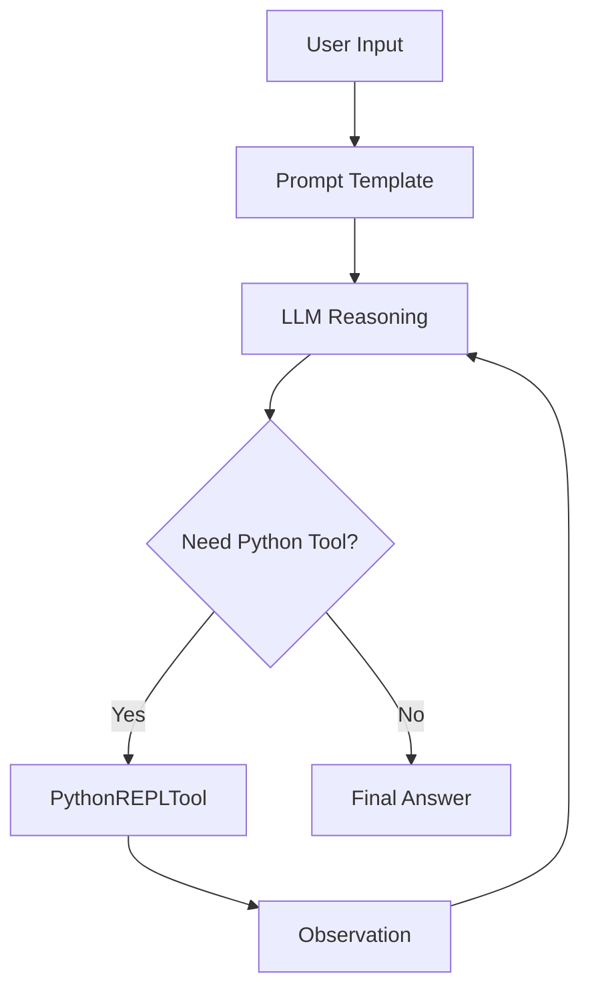

# Agentic AI in Google Colab — Factorial Use Case 1


A beginner-friendly **Agentic AI** project built in **Google Colab** that shows how an LLM can reason, choose a tool, execute Python code, observe the result, and return a final answer.

This repository uses a simple mathematical task — **calculating the factorial of 6** — to demonstrate the core architecture of an AI agent.

---

## Table of Contents

- [Overview](#overview)
- [Why This Project](#why-this-project)
- [What This Project Demonstrates](#what-this-project-demonstrates)
- [Architecture](#architecture)
- [Tech Stack](#tech-stack)
- [Project File](#project-file)
- [How the Code Works](#how-the-code-works)
- [How to Run](#how-to-run)
- [Expected Output](#expected-output)
- [What I Learned](#what-i-learned)
- [Known Notes](#known-notes)
- [Possible Enhancements](#possible-enhancements)
- [License](#license)

---

## Overview

This project is a foundational hands-on example of **Agentic AI**.

Instead of asking a language model to directly answer a math question, this notebook turns the model into an **agent** that can:

1. receive a task,
2. reason about what to do,
3. decide whether to use a tool,
4. execute code using Python,
5. observe the result,
6. return the final answer.

The use case is intentionally small so the focus stays on the **agent design pattern**, not on business complexity.

---

## Why This Project

When learning Agentic AI, it is useful to start with a very small and clear example.

A factorial problem is a good first use case because it helps demonstrate:

- how an agent is structured,
- how a tool is attached to the agent,
- how prompts guide tool usage,
- how the executor manages the reasoning loop,
- and how the model can delegate computation to Python.

This repository is meant to build a strong foundation before moving to larger use cases such as APIs, cloud automation, Jira workflows, or RAG systems.

---

## What This Project Demonstrates

This project demonstrates the following core ideas:

- **LLM as reasoning engine**
- **Python tool as external capability**
- **Prompt-driven agent behavior**
- **ReAct-style interaction pattern**
- **Executor-managed action loop**
- **Beginner-friendly Colab setup**
- **Custom streaming patch for stable execution**

---

## Architecture

### High-Level Flow

```text
User Task
   ↓
Prompt Template
   ↓
Language Model
   ↓
Reasoning
   ↓
Choose Tool
   ↓
Run Python Tool
   ↓
Observe Result
   ↓
Final Answer

This project follows a simple agent loop where the language model reasons about the task, decides whether a tool is needed, executes the tool if required, observes the result, and then returns the final answer.
```
### Agent Loop



## Tech Stack

This project is built using the following tools and frameworks:

- **Python** — core programming language
- **Google Colab** — notebook environment for development and execution
- **LangChain Classic** — agent framework components
- **LangChain Experimental** — experimental tools such as `PythonREPLTool`
- **LangChain Hugging Face** — integration between LangChain and Hugging Face models
- **Hugging Face Transformers** — model and tokenizer loading
- **Accelerate** — model execution support
- **Qwen/Qwen2.5-1.5B-Instruct** — instruction-tuned language model used as the reasoning engine


## Project File

```text
ai_agent_math_factorial.py
```

## How the Code Works

The program follows this structure:

### 1. Install dependencies
The notebook installs the required LangChain and Hugging Face libraries needed to run the agent and model pipeline.

### 2. Import required modules
It imports:
- Hugging Face model and tokenizer utilities
- LangChain agent components
- Python REPL tool
- prompt utilities
- streaming-related classes

### 3. Patch the Hugging Face streaming behavior
A custom class named `PatchedHuggingFacePipeline` extends `HuggingFacePipeline`.

Why this matters:
- the default streaming path can sometimes fail in Colab-like environments
- this patched version uses a safer streaming setup
- it helps the agent run more reliably

### 4. Load the model
The code loads (This model is used as the reasoning engine for the agent.):

```text
Qwen/Qwen2.5-1.5B-Instruct

